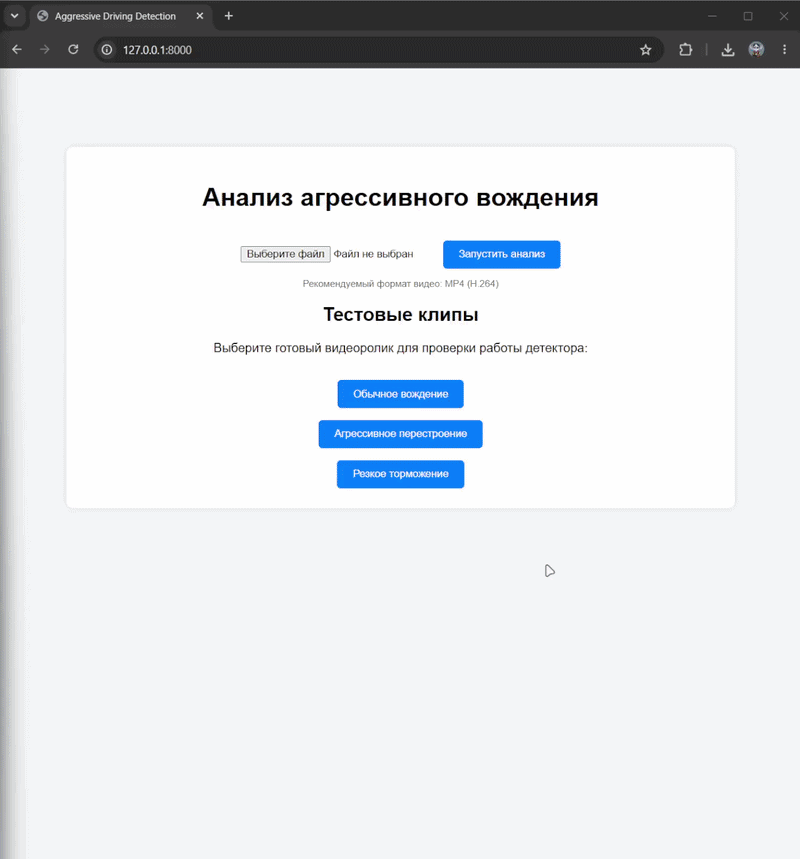
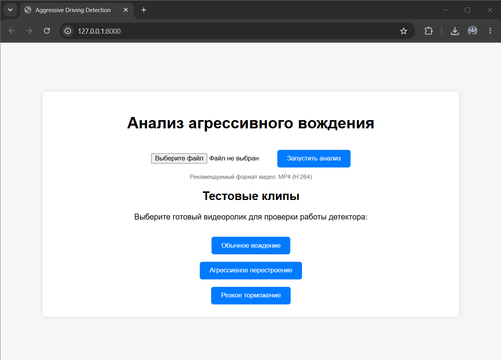
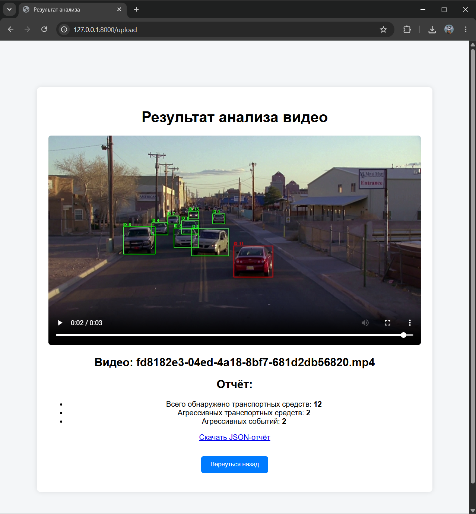
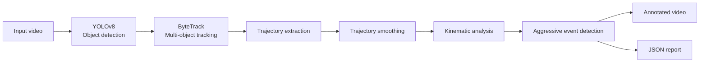

# Trajectory-Based Aggressive Driving Detection

A computer vision system for detecting potentially aggressive driving behavior from video footage captured by a fixed camera.

The system detects and tracks vehicles, reconstructs their trajectories, calculates motion characteristics in image coordinates, and identifies potentially aggressive driving events using a set of manually tuned kinematic and temporal criteria.

The current implementation is designed as an offline web application with a FastAPI interface.

## Demo



The application provides a simple web interface where the user can:

* upload a video for analysis;
* select one of the included test clips;
* view the processed video with tracked vehicles and detected aggressive events;
* view a summary of the analysis;
* download the generated JSON report.

## Application interface

### Main page



### Result page



## Features

* Vehicle detection using YOLOv8.
* Multi-object tracking using ByteTrack.
* Trajectory reconstruction for tracked vehicles.
* Trajectory smoothing and kinematic analysis.
* Detection of potentially aggressive driving events using multiple motion characteristics.
* Temporal aggregation of detected events to reduce isolated false positives.
* Annotated output video with vehicle IDs and highlighted aggressive events.
* JSON report containing analysis statistics.
* Web interface based on FastAPI.
* Built-in test videos for quick evaluation.
* Support for processing user-provided video files.

## Pipeline



The video is processed in two main passes:

1. **Detection and tracking pass** — vehicle detections and trajectories are collected.
2. **Analysis and annotation pass** — trajectories are analyzed, aggressive events are identified, and the final video is generated with annotations.

## Technologies

* Python
* OpenCV
* NumPy
* SciPy
* Ultralytics YOLOv8
* ByteTrack
* FastAPI
* Jinja2
* HTML/CSS

## How It Works

### 1. Object Detection

YOLOv8 is used to detect vehicles in each video frame.

The current configuration analyzes the following COCO object classes:

* car;
* motorcycle;
* bus;
* truck.

The YOLOv8 model and ByteTrack configuration were selected after a comparative evaluation of different object detection and tracking combinations on test video footage.
The tested combinations of popular detectors and trackers include:

* SSD + DeepSORT
* SSD + ByteTrack
* YOLOv8 + DeepSORT
* YOLOv8 + ByteTrack
* Faster R-CNN + DeepSORT
* Faster R-CNN + ByteTrack

The combination of YOLOv8 and ByteTrack achieves an optimal balance between speed (~80 FPS), accuracy (MOTA ~0.51), and stability (IDF1 ~0.65).

### 2. Tracking

ByteTrack associates detections between consecutive frames and assigns persistent track IDs to individual vehicles.

This allows the system to analyze not only individual frames, but also the motion of each tracked vehicle over time.

### 3. Trajectory Extraction

For each tracked vehicle, the system stores:

* frame numbers;
* bounding boxes;
* center coordinates.

The center coordinates are used to reconstruct the vehicle's trajectory in image space.

### 4. Kinematic Analysis

The trajectories are smoothed using a Savitzky–Golay filter.

Based on the resulting trajectories, the system calculates motion characteristics such as:

* velocity;
* acceleration;
* changes in movement direction;
* curvature-related characteristics;
* speed changes;
* deceleration;
* an approximate time-to-collision (TTC) indicator.

These characteristics are calculated in image coordinates rather than in real-world metric units.

### 5. Aggressive Driving Detection

Potentially aggressive events are identified using a rule-based scoring system.

Several indicators contribute to an event score, including:

* sudden changes in movement direction;
* high curvature of the trajectory;
* significant changes in speed;
* strong deceleration;
* a low approximate TTC value.

An event is considered significant when the combined score exceeds a predefined threshold and the detected behavior persists for a minimum number of consecutive frames.

The current thresholds were manually tuned based on visual analysis of video clips representing normal and aggressive driving behavior.

## Installation

### 1. Clone the repository

```bash
git clone https://github.com/Belousov-Alexey/AggressiveDrivingDetection
cd aggressive-driving-detection
```

### 2. Create a virtual environment

```bash
python -m venv .venv
```

Activate it on Windows:

```bash
.venv\Scripts\activate
```

On Linux/macOS:

```bash
source .venv/bin/activate
```

### 3. Install dependencies

```bash
pip install -r requirements.txt
```

### 4. Model

The required YOLOv8 model is located in:

```text
models/yolov8m.pt
```

No additional model training is required to run the current version of the project.

## Usage

Start the FastAPI application:

```bash
uvicorn app:app --reload
```

Open the application in a browser:

```text
http://127.0.0.1:8000
```

The main page provides two options:

1. Upload your own video file.
2. Select one of the built-in test clips.

After processing, the application displays:

* the annotated output video;
* the number of tracked vehicles;
* the number of vehicles classified as aggressive;
* the total number of detected aggressive events;
* a link to the generated JSON report.

## Test Videos

The repository contains several test clips:

| File                         | Description                       |
| ---------------------------- | --------------------------------- |
| `normal_driving.mp4`         | Normal driving behavior           |
| `aggressive_lane_change.mp4` | Aggressive lane-changing scenario |
| `aggressive_braking.mp4`     | Aggressive braking scenario       |

The clips can be selected directly from the web interface without uploading them manually.

Some aggressive-driving scenarios were recorded in the GTA V game environment. The game environment was used to conveniently simulate driving situations for which sufficient real-world surveillance footage was not available.

These scenarios are useful for evaluating the behavior of the algorithm, but they cannot fully represent the diversity of real-world traffic conditions.

## Output

For each processed video, the system generates:

### Annotated video

Vehicles are displayed with their tracking IDs.

Detected aggressive events are highlighted in the output video.

### JSON report

The report contains summary information such as:

```json
{
  "output_video": "example.mp4",
  "total_tracks": 19,
  "aggressive_tracks": 1,
  "total_events": 1,
  "events": {
    "8": 1
  }
}
```

The report is generated automatically for each processed video.

## Project Structure

```text
aggressive-driving-detection/
├── app.py
├── main_pipeline.py
├── config.py
├── requirements.txt
├── .gitignore
│
├── docs/
│   ├── demo.gif
│   ├── main-page.png
│   └── result-page.png
│
├── models/
│   └── yolov8m.pt
│
├── test_clips/
│   ├── normal_driving.mp4
│   ├── aggressive_lane_change.mp4
│   └── aggressive_braking.mp4
│
├── templates/
│   ├── index.html
│   └── result.html
│
├── static/
│   └── style.css
│
├── uploads/
│   └── .gitkeep
│
└── results/
    └── .gitkeep
```

## Limitations

The current implementation has several important limitations.

### Camera perspective

The system is designed for footage from a fixed camera. The position and angle of the camera significantly affect the interpretation of vehicle motion and detected maneuvers.

### Image-space motion

Motion characteristics are calculated in image coordinates rather than real-world metric units. Perspective and projection effects therefore limit the accuracy of velocity, acceleration and TTC-related estimates.

### Lighting and video quality

Detection and tracking quality depends on factors such as:

* lighting conditions;
* video resolution;
* camera position;
* object visibility;
* occlusions.

### Occlusions and track instability

Large bounding boxes, object entry and exit at the image boundaries, and complete occlusions can introduce residual noise.

In isolated cases, complete occlusion can also result in an ID switch during tracking.

### TTC limitations

Sudden braking and vehicle approaches are not always detected reliably because their visual characteristics depend strongly on the camera viewpoint and available depth information.

Increasing sensitivity to such events can also increase the amount of false detections.

### Rule-based detection

Aggressive driving is currently detected using manually designed rules and thresholds rather than a trained classification model.

The thresholds were manually selected using visual analysis of normal and aggressive driving clips.

### Temporal interpretation

The temporal logic of the detector affects the interpretation of driving maneuvers. The current system expects a sufficiently clear transition from normal motion to aggressive behavior over time.

### Dataset limitations

The available aggressive-driving scenarios are limited.

Although the GTA V clips provide a convenient and reproducible way to simulate aggressive driving situations, simulated scenarios may not fully reflect the behavior and visual characteristics of real vehicles on public roads.

### Offline processing

Video processing is currently performed synchronously and offline. Processing time can reach several minutes depending on video length, resolution and available hardware.

YOLOv8 inference can be computationally expensive when running on a CPU.

## Future Improvements

Possible directions for further development include:

* classification of aggressive maneuver types, such as aggressive lane changes, sudden braking and rapid approach;
* reduction of residual noise, particularly near image boundaries;
* adaptation of the system for real-time video streams;
* asynchronous video processing;
* automated parameter selection for specific camera conditions;
* training or fine-tuning models on a dedicated labeled dataset;
* integration of additional scene information, such as lane markings, road lanes and traffic-light states;
* improved temporal aggregation of detected events;
* optimization of the current two-pass video processing pipeline;
* evaluation on a larger and more diverse real-world dataset.

## License

No separate license has currently been defined for this project.

The project uses third-party libraries and models that are distributed under their respective licenses. Users should refer to the licenses of the corresponding dependencies before redistributing or deploying the project.

## Acknowledgements

This project uses:

* Ultralytics YOLO for object detection;
* ByteTrack for multi-object tracking;
* OpenCV for video processing;
* SciPy for trajectory smoothing and numerical analysis;
* FastAPI for the web application.
